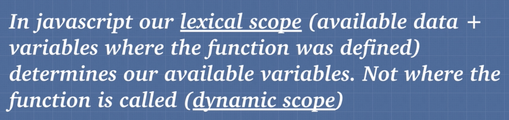

## FONDATION

# Execution context


* Когда код запущен в js-engine  global execution context создан, когда запускаем функцию добавляеться новый execution context


# Lexical enviroment 

* Lexical enviroment - где код написан


функция a() - лексически в findName окружении

<strong>lexical scope</strong> - где функция была определена. Все в js lexical scope, кроме <strong>this</strong>

<strong>dinamic scope</strong> - где функция была вызвана. В js это   <strong>this</strong>

Определение : 



```bash
    function(){} - dinamic scope
    () => {} - lexical scope
```

# Hoisting
```bash
    console.log(teddy);    #// => undefined
    console.log(sing());   #// => 'sing'
    var teddy = 'bear';
    function sing(){
        console.log('sing');
    }
```

процесс под капотом можно изобразить так:
```bash
    var teddy = undefined;
    function sing(){
        console.log('sing');
    }
    console.log(teddy);    #// => undefined
    console.log(sing());   #// => 'sing'
    var teddy = 'bear';
```

```bash
    console.log(teddy);    #// => undefined
    console.log(sing2());   #// => error
    console.log(sing2);   #// => undefined
    var teddy = 'bear';

    # // function expression
    var sing2 = function(){
        console.log('sing2');
    }
    # // function declaration
    function sing(){
        console.log('sing');
    }
```

### упражнение 1
```bash
    console.log(one); #// => undefined
    var one = 1;
    var one = 2;
```
    
```bash
    a(); #// => 'bye'
    function a() {
        console.log('hi')
    }
    function a() {
        console.log('bye')
    }
```

### упражнение 2
```bash
    var favouriteFood = "grapes";

    var foodThoughts = function () {
        console.log("Original favourite food: " + favouriteFood); #// => undefined

        var favouriteFood = "sushi";

        console.log("New favourite food: " + favouriteFood); #// => 'sushi'
    };

    foodThoughts()
```
Под капотом:
```bash
    var favouriteFood = undefined;
    var foodThoughts = undefined;
    var favouriteFood = "grapes";

    var foodThoughts = function () {
        var favouriteFood = undefined;
        console.log("Original favourite food: " + favouriteFood); #// => undefined

        var favouriteFood = "sushi";

        console.log("New favourite food: " + favouriteFood); #// => 'sushi'
    };

    foodThoughts()
```
    
```bash
    var favouriteFood = "grapes";

    var foodThoughts = function () {
        console.log("Original favourite food: " + favouriteFood); #// => grapes

        favouriteFood = "sushi"; если убрать var, то все будет нормально

        console.log("New favourite food: " + favouriteFood); #// => 'sushi'
    };

    foodThoughts()
```

# Избегать в коде чтобы помоч js engine оптимизировать код


# Arguments 
    
```bash
    //arguments лучше избегать в коде
    function marry(person1, person2) {
    console.log(arguments)
    console.log(Array.from(arguments))
    return `${person1} is now married to ${person2}`
    }

    function marry2(...args) {
    console.log(args)
    return `${args[0]} is now married to ${args[1]}`
    }

    marry('Tim', 'Tina')
    marry2('Tim', 'Tina')
```

# Variable enviroment
Каждый execution context имеет свой Variable enviroment

```bash
function two() {
  var isValid; // undefined
}

function one() {
    var isValid = true; // local env
        two(); // New execution context created.
    }

    var isValid = false;
    one();

    //two() --undefined
    //one() --true
    //global --false
```

# Scope chain

Каждый execution context имеет ссылку на родителя и на внешнее окружение

```bash
    function findName() {
    var b = 'b';
    return printName();
    }

    function printName() {
    var c = 'c'
    return 'Andrei Neagoie'
    }

    function sayMyName() {
    var a = 'a';
    return findName()
    }

    sayMyName()
```

Scope chain -  ссылка которая дает нам доступ к переменным parrent enviroment


```bash
// Scope:
function sayMyName() {
  var a = 'a';
  return function findName() {
    var b = 'b';
    console.log(a+b) #// => ab
    return function printName() {
        var c = 'c';
        console.log(a+b+c) #// => abc
        return 'Andrei Neagoie'
    }
  }
}

sayMyName()()()
```
 
 


# werid in js

```bash 
    function weird() {
        height = 50
    }
    weird()
```

```bash 
    var heyhey = function doodle() {
        console.log('zz')
    }

    heyhey();
    doodle(); // Error! because it is enclosed in its own scope.
```

# function scope VS block scope


function scope:
```bash
    if(5 > 4){
        var secret = '12345';
    }
    secret;  #// => '12345'

    function a(){
        var secret = '12345';
    }
    secret;  #// => error
```

block scope:
```bash
    if(5 > 4){
        let secret = '12345';
    }
    secret;  #// => error
```

### упражнение 3
```bash
    //Function Scope
    function loop() {
    for( var i = 0; i < 5; i++) {
        console.log(i);
    }
    console.log(i) #// => 5
    }

    //Block Scope
    function loop2() {
    for( let i = 0; i < 5; i++) {
        console.log(i);
    }
    console.log(i) #// => error
    }

```

# IIFE

```bash
    var script1 = (function(){
        function a(){
            return 5;
        }
        return { a: a}
    })();

    script1.a() #// => 5
```

```bash 
    var aController = (function(){
        var a = 5;
        var b = 3;
        return {
            AA: a,
            BB: b
        }
    });
    var bController = (function(){
        var a = 50;
        var b = 30;
        return {
            AA: a,
            BB: b
        }
    });

    var controller = (function(aa,bb){
        aa.AA + aa.BB #// => 8 
        aa.AA + bb.AA #// => 55 
    })(aController, bController)
```


# this
```bash
    obj.func(this) this ссылаеться на obj
    function a(){
        console.log(this) #// => window
    }
```

```bash
    const obj = {
        name: 'Billy',
        sing: function() {
            return 'llala ' + this.name;
        },
        singAgain: function() {
            return this.sing() + '!'
        }
    }
    obj.singAgain();
```

```bash
    function importantPerson() {
        console.log(this.name)
    }

    const name = 'Sunny';
    const obj1 = { name: 'Cassy', importantPerson: importantPerson}
    const obj2 = { name: 'Jacob', importantPerson: importantPerson}

    obj2.importantPerson()
```
# lexical scope vs dynamic scope

* lexical scope - доступные данные и переменные где функция была определена (все кроме this)
* dynamic scope - где функция была вызвана (this)

### упражнение 4
```bash
    const a = function() {
    console.log(this) #// => window
    const b = function() {
        console.log(this) #// => window
        const c = {
        hi: function() {
            console.log(this) #// => hi[Function]
        }
        }
        c.hi()
    }
    b()
    }
    a()
```

dynamic scope
```bash
    const obj = {
        name: 'Billy',
        sing: function() {
            console.log(this); #// {name: "Billy", sing: f}
            var anotherFunc = function() {
            console.log(this); #// => windows!
            }
            anotherFunc();
        }
    }
```

lexical scope
```bash

    const obj = {
        name: 'Billy',
        sing: function() {
            console.log(this); #// {name: "Billy", sing: f}
            var anotherFunc = () => {
                console.log(this); #// {name: "Billy", sing: f}
            }
            anotherFunc();
        }
    }
    obj.sing();
```

```bash
    const obj = {
        name: 'Billy',
        sing: function() {
            console.log(this); #// {name: "Billy", sing: f}
            var anotherFunc = function() {
                console.log(this); #// {name: "Billy", sing: f}
            }
            return anotherFunc.bind(this);
        }
    }
    obj.sing()();
```

```bash
    const obj = {
        name: 'Billy',
        sing: function() {
            console.log(this); #// {name: "Billy", sing: f}
            var self = this;
            var anotherFunc = function() {
                console.log(self); #// {name: "Billy", sing: f}
            }
            anotherFunc()
        }
    }
    obj.sing();
```


# call() apply()


```bash
    functiona a(){
        colsole.log('hi');
    }

    a.call();
```

```bash
    const wizard = {
        name: 'Merlin',
        health: 100,
        heal: function(num1, num2) {
            this.health += num1 + num2;
        }
    }

    const archer = {
        name: 'Robin Hood',
        health: 50
    }

    wizard.heal.call(archer, 50, 60)
    wizard.heal.apply(archer, [20, 30])
    archer
    // function borrowing

    const healArcher = wizard.heal.bind(archer, 50, 60);
    console.log(archer)
    healArcher()
    console.log(archer)
```

# currying function
```bash
    function multiply(a, b) {
        return a*b; #// returrn 2*b; if multiply.bind(this, 2);
    }

    var multipleByTwo = multiply.bind(this, 2);
    console.log(multipleByTwo(4));

    var multipleByThree = multiply.bind(this, 3);
    console.log(multipleByThree(4));
```


### упражнение 5
```bash
var b = {
  name: 'jay',
  say() {console.log(this)}
} 
b.say() #// { name: 'jay', say: [Function: say] }

var c = {
  name: 'jay',
  say() {return function() {console.log(this)}}
}
c.say() #// [Function]
c.say()() #// window

var d = {
  name: 'jay',
  say() {return () => console.log(this)}
}
d.say()() #// { name: 'jay', say: [Function: say] }
```